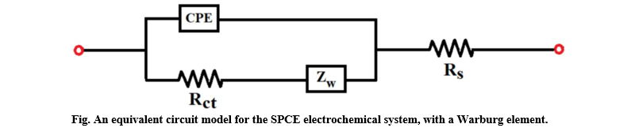
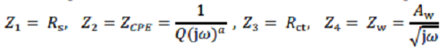
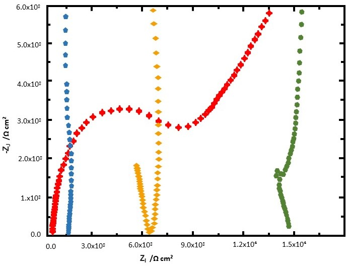
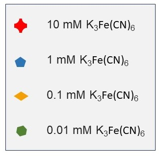

### Introduction:

Electrochemical impedance spectroscopy (EIS) is a widely used technique for investigating the electrode/electrolyte interface properties. It is a powerful electroanalytical method to analyze the electrochemical behaviors 
of electrodes. EIS is performed by measuring the alternating current potential to an electrochemical cell and then measuring the current through the cell. It is a non-invasive and effective tool for studying sensor 
characteristics. This technique, along with CV method, is utilized to examine the screen-printed carbon-based electrodes, their magnitude of background currents, and their potential windows. SPCE is an alternative
 material used instead of conventional electrodes based on low background current, large potential window, and high chemical stability. Equivalent circuit models (ECMs) are used to analyze and interpret the impedance
 data of electrochemical systems. The equivalent circuit model for the SPCE electrochemical system, with the Warburg element, is depicted below.. 
  

  

   
 
 
For the equivalent circuit model (ECM), the overall impedance ZA is defined as 
 

Rs =  electrolyte solution resistance, Rct = charge transfer resistance, 
CPE = a constant phase element, and Zw = Warburg impedance, expresses the impedance of ion diffusion to the electrode. Nyquist plot graph is a graph that plots impedance values measured at different frequencies. 
Impedance responses of different concentrations of K3Fe(CN)6 in the Nyquist format are shown below.  
 
  
